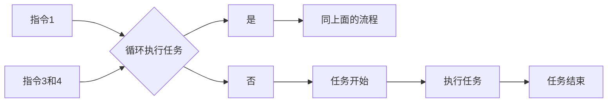

# DailyTask

## 1. 本软件完全免费！

## 2. 近期发现有人在咸鱼私自倒卖本软件，请勿购买！如有购买，请联系卖家退款！

## 3.另外，由于有人倒卖本工具，所以，Github不再提供安装包，如有能力可自行编译源码，否则进QQ群获取。

# 使用须知

## 1. 本软件本地运行，无服务器备份，不存在窃取隐私和泄密！

## 2. 因为有远程指令功能，所以必须监听QQ、微信等及时通讯软件消息，才能正常执行远程指令，并且监听的是通讯软件的小号。如果介意此功能，请绕道，不必进群获取安装包了！

## 3. 另外，在质疑别人之前，请自行补充下相关知识，别在外面丢人现眼！请务必先阅读本软件的使用说明，并确认是否了解本软件的功能和用法!

# 真·气的肝疼！如果哪天这个项目没了，应该就是类似的人多了，那么各位就自求多福吧！

# 软件介绍

1. Kotlin+Java混编实现的打卡小工具，缓解上班路途遥远的燃眉之急，只需一部备用手机置于公司工位，设置一下上下班打卡时间即可。
2. 兼容到 `Android 8` ~ `Android 16` 或者 `鸿蒙 4.0` 系统，小米的澎湃系统需要自行测试。
3. 本软件最开始的本意是方便自己，后来由于换了新单位，此款软件不再使用，故选择开源，如有不到之处还请谅解。
4. **本软件属于无人值守方案，不会修改各类签到软件内部逻辑，也不会修改手机位置，请注意！！**！
5. 本软件仅限学习和内部使用，严禁商用和用作其他非法用途，如有违反，与本人无关！！！
6. 对目前功能不满意或者想加功能的，有能力的可以自行下载源码修改，也可以在群里反馈了等我发布新版本。
7. 手机不能灭屏。灭屏状态下，常驻通知服务会被系统回收，导致无法打卡。另外锁屏后再解锁，在部分手机上并不会直接进入桌面，会无法调起软件。
8. 主界面按音量`减小键`，会开启伪装灭屏模式，该模式下不影响打卡，再按一次，会退出伪装模式。另外伪灭屏模式支持手势触发（上下滑动屏幕即可）。
9. 默认每天都会打卡，如果不需要可以发送`暂停循环`指令，远程控制任务执行（大号给小号发，QQ、微信、支付宝、TIM都支持），具体操作流程图见下文。
10. 如果要用，最好先自行测试几天，稳定确认没问题之后再使用，并请做好隐蔽工作，不要被人发现！如果被发现，后果自负。

------

# 最新版本 2.3.1.0 —— 更新时间：2026年4月13日09点28分

1. 删除通知记录功能（不影响指令`7`）
2. 优化指令`1`、`2`、`3`、`4`（语义微变，注意！！！）
3. 优化截图服务
4. 新增悬浮窗权限手动开启功能
5. 新增“悬浮权限”、“通知监听”、“截屏服务”三项核心服务无法手动关闭的提示

------

# 使用步骤（**目标应用必须要支持极速打卡且已设置为极速打卡**）：

1. [x] 打开`DailyTask`，会自动检测悬浮窗权限，找到`DailyTask`软件，打开悬浮窗权限即可。
2. [x] 在手机`设置`里面打开通知中心，然后找到`DailyTask`，点进去后打开允许通知开关。
3. [x] 在`DailyTask`的`设置`里面设置`结果来源`，默认为`通知监听`（只适用于`钉钉`）,`截屏服务`
   理论上可以获取任何应用的打卡结果。
4. [x] 消息渠道设置
    1. 企业微信：登录企业微信，随便拉个朋友或者自己弄个小号建立一个群聊，然后点击群聊右上角，进去之后在那个界面找到
       `消息推送`，点击进去之后在那个界面配置一下名称，点击下面的`webhook地址`复制出来后点击保存，最后把复制出来的
       `webhook地址`最后面的key值填入到`DailyTask`的消息渠道的企业微信渠道里面即可。
    2. QQ邮箱：输入发件箱以及发件箱的授权码（不是邮箱密码！！！），然后填写收件箱，其他的随意。另外，发件箱和收件箱可以是同一个邮箱。
5. [x] 在`DailyTask`的`设置`打开通知监听开关（如果未打开此开关，此开关底部会有一行红色小字）。找到
   `DailyTask`软件，打开即可。
6. [x] 如果钉钉无法监听到打卡结果，或者飞书、企业微信这种没有打卡通知的，一定要把这个打开！弹窗显示选择
   `整个屏幕`即可。
7. [x] 在你设置好消息渠道并且已经打开截屏服务，那么可以通过`截屏测试`
   来确认截屏服务以及消息渠道是否正常工作，能收到消息渠道的反馈即为正常。
8. [x] 如果想通过QQ，TIM、微信、支付宝消息唤起目标应用打卡，在`DailyTask`的`设置`
   界面点击唤起测试，确认以上应用是否有权限打开目标应用，如果不需要可以跳过此步骤。

好了，基本设置就是这样了。

# 支持的远程指令：

| 序号 | 指令     | 功能                                  | 是否有邮件通知 |
|:---|:-------|:------------------------------------|---------|
| 1  | `执行任务` | 启动循环任务（默认每天都会执行）                    | 否       |
| 2  | `终止任务` | 停止循环任务（只会停止当天的任务）                   | 否       |
| 3  | `开启循环` | 循环任务标志位                             | 是       |
| 4  | `关闭循环` | 循环任务标志位（收到此指令后，会永远暂停执行，除非再次收到指令`3`） | 是       |
| 5  | `息屏`   | 开启伪灭屏模式                             | 否       |                                  
| 6  | `亮屏`   | 退出伪灭屏模式                             | 否       |
| 7  | `考勤记录` | 导出当天的考勤记录                           | 是       |
| 8  | `打卡`   | 默认为“打卡”，如果自己修改过指令，按修改后的指令发送         | 否       |
| 9  | `状态查询` | 获取当前APP状态，包括任务、服务、监听状态、电量、版本、日期等    | 是       |
| 10 | `截屏`   | 截取一张目标应用的屏幕，并通过消息渠道反馈给用户            | 是       |

注意：

- 如果要每天打卡，那就不必关注指令`3`和`4`。

- 如果要控制任务执行的日期，请结合指令`1`、`3`和`4`。

## 如果还有问题，请加QQ群，群内只回答没在此文档提到的问题，其余问题自行看文档，一定要仔细看完！！！：

- 560354109（①群，200人群）——已满
- 643595483（②群，500人群）
- 377923252（③群，500人群）

# 已知会被检测到作弊的原因：

| 序号 | 原因                             |
|:---|:-------------------------------|
| 1  | 手机已经root（被检测到作弊的概率极大）          |
| 2  | 使用了模拟定位软件试图修改打卡位置（被检测到作弊的概率极大） |
| 3  | 使用了向日葵等远程远程控制软件打开（被检测到作弊的概率极大） |
| 4  | 试图使用adb命定模拟手指点击打卡（被检测到作弊的概率极大） |
| 5  | 手机开启了无障碍服务                     |
| 6  | 手机数据线连着电脑                      |

# 历史版本看这里：

| 版本号     | 版本说明                                                                                                                                                                                                                                                                                                         |
|:--------|:-------------------------------------------------------------------------------------------------------------------------------------------------------------------------------------------------------------------------------------------------------------------------------------------------------------|
| 2.0.0   | 1. 全新版本，全新的界面，全新功能！支持每日循环打卡，每日每次打卡时间会自动在设定的时间点5分钟内随机选择一个时间点打卡 2. 解决1.+版本遗留的问题                                                                                                                                                                                                                             |
| 2.0.1   | 1. 解决QQ邮箱、163邮箱、126邮箱、yeah邮箱发送邮件失败问题                                                                                                                                                                                                                                                                         |
| 2.0.2   | 1. 优化通知监听服务和通知缓存逻辑                                                                                                                                                                                                                                                                                           |
| 2.0.3   | 1. 修复倒计时任务进度条重叠问题 2. 优化小概率崩溃问题                                                                                                                                                                                                                                                                            |
| 2.0.4   | 1. 添加远程启动和停止每日任务功能（`此功能必须开启通知监听，否则指令无效`）。开始每日任务指令：`启动`。停止每日任务指令：`停止`。 2. 修复部分手机打完卡状态栏常亮问题                                                                                                                                                                                                                 |
| 2.0.5.1 | 1. 升级AGP，提升targetSdk到36（Android 15），适配Android 15版本新特性。 2. 更改数据持久化框架，使用官方Room框架                                                                                                                                                                                                                            |
| 2.0.6   | 1. 重构应用主题样式。 2. 增加自定义超时时间功能。 3. 优化循环任务启动和停止的逻辑与提示信息                                                                                                                                                                                                                                                    |
| 2.1.0   | 1. 优化邮件发送失败的错误处理和消息显示 2. 优化程序前台保活服务 3. 调整每日任务界面，去掉顶部实时计时显示 4. 新增随机时间开关，用户可自行控制是否需要生成随机任务时间点 5. 新增任务计时后台服务，解决任务计时延迟问题 6. 新增任务执行邮件通知 7. 新增伪灭屏状态下拦截电源键并添加时钟显示，让手机看起来更像是真的进入休眠                                                                                                                 |
| 2.1.1.0 | 1. 修改前台服务通知标题 2. 优化从目标应用返回软件主页面的逻辑 3. 优化保活服务和后台计时服务 4. 优化任务状态更新逻辑                                                                                                                                                                                                                                   |
| 2.2.0.0 | 1. 添加每日任务重置时间点设置，默认每天0点重置 2. 添加下拉刷新任务列表功能，解决删除任务小概率会失败的问题 3. 重构消息处理机制 4. 优化邮箱配置检查机制 5. 调整应用界面UI效果                                                                                                                                                                                                |
| 2.2.1.0 | 1. 主界面显示蒙层时，时钟颜色改为70%透明度白色，并添加随机变换时钟位置动画，降低烧屏风险 2. 修改通知邮件的任务时间为实际时间 3. 添加随机时间范围自定义功能，默认为5分钟                                                                                                                                                                                                            |
| 2.2.2.1 | 1. 删除悬浮窗开关，改为强制开启（不开启会导致无法进行循环任务） 2. 优化邮箱配置判断逻辑，改为不设置邮箱也能正常执行任务 3. 简化邮箱配置，去掉其他邮箱支持，发件箱只支持QQ邮箱                                                                                                                                                                                                          |
| 2.2.5.1 | 1. 重构应用主界面 2. 解决应用广播在Android 13以上版本无法收到的问题 3. 解决邮箱配置Session缓存导致邮件发送失败的问题 4. 解决因部分指令相同前缀导致指令错误执行的问题 5. 解决内部通信消息混乱的问题 6.优化每日任务执行和通知监听服务以及悬浮窗启动逻辑 7.优化伪灭屏显示效果 8.增加5条指令——【指令：`考勤记录`】、【指令：`息屏`】、【指令：`亮屏`】、【指令：`开始循环`】、【指令：`暂停循环`】 9.增加手势开启伪灭屏【单手指从上到下滑动——开启，单手指从下到上滑动——关闭】，并支持选择是否开启，默认关闭 |
| 2.2.6.5 | 1. 解决执行完任务后原有任务列表会停止的问题 2. 支持导出/导入所有信息（任务+配置） 3. 部分界面添加免费声明水印 4. 添加企业微信消息通知渠道，可选择将原来的邮件通知转成企业微信推送 5. 添加可选择目标应用入口，弱支持企业微信和飞书                                                                                                                                                                      |
| 2.3.0.0 | 1. 修复打卡成功后定时器未取消的问题 2. 修复删除任务后数据不一致问题 3. 重构每日任务自动重置功能 4. 微调主界面样式，任务列表添加展开和收缩动画效果 5. 全面支持`钉钉`、`飞书`、`企业微信`、`移动办公M3`等签到软件 6. 添加图片消息和附件邮件发送功能 7. 添加打卡后自动截屏功能，并支持远程截屏（见下文指令`10`） 8. 添加状态查询功能（见下文指令`9`） 9. 添加任务配置分享功能，支持QQ、微信、TIM、支付宝和剪切板，方便任务配置一键导出                                    |

# 打卡结果如下：

| 打卡结果 | 说明                                                                          |
|:-----|:----------------------------------------------------------------------------|
| 成功   |                                                 |
| 失败   | 1.账号被自己另一个手机挤下去   2.未设置极速打卡   3.应用内部打卡通知或者手机通知被关闭   4.打卡手机有2个以上 |
